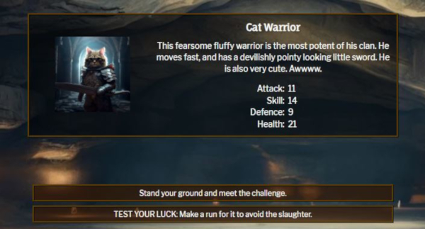

# Testing Documentation

([return to README](README.md))

## Contents

### Audit and Validation

[HTML Validation](#html-validation)\
[CSS Validation](#css-validation)\
[JavaScript Validation](#javascript-validation)\
[Lighthouse Audit](#lighthouse-audit)

### User Story Validation

[Site Owner User Stories](#site-owner-user-stories)\
[Site Visitor User Stories](#site-visitor-user-stories)

### Testing

[Automated Testing](#automated-testing)\
[Manual Testing](#manual-testing)\
[Bugs and Issues](#bugs-and-issues)

## Code Validation

### HTML Validation

([back to top](#testing-documentation))

I have completed a final validation of all HTML pages using the [W3C HTML validator](https://validator.w3.org/).

The issues that needed resolving were as follows:
 - There were a number of empty elements that were to be populated by Javascript which needed holding text. 
 - There were duplicate IDs on some buttons that were used in seperate game states, which needed changing to a class.
 - Images needed alt tags.  This was no small task, as it required adding alt tags to 40 game objects and updating the JavaScript accordingly in order to display the text.  There were also a number of default alt tags that needed adding in html.

### CSS Validation

([back to top](#testing-documentation))

I have completed a final validation of my 'style.css' file using the [W3C CSS validator](https://jigsaw.w3.org/css-validator/).\
There was one error caused by a likely copy and paste error, which was easily fixed.

### JavaScript Validation

I initially used JSLint but found it was overly strict. Not only did I have hundreds of warnings concerned with alphabetical order in objects, it also refused to recognise 'for' loops as legitimate JavaScript.
The research I subsequently did suggests that the use of 'for' loops is a matter of preference, and it's certainly a method I have been taught on the course as standard practice!
Faced with the choice of either re-configuring JSlint or refactoring more or less every line of my code I decided to look for an alternative.
After some research I decided that ESlint would be the most appropriate linter to use for this project.

On testing my JavaScipt file for errors, I found six using ES lint:
   - Multiple errant semi-colons.
   - A duplicate function to close alerts on the homepage.
   - I had wrongly assigned my item filter function to a constant.  I'm not actually sure how or why it was working at all prior to amending it!

Following my final meeting with my mentor, he recommended I pass the file through jshint.  
It turned up a number of errors, mostly involving missing semicolons, but now the code passes through cleanly:

### Lighthouse Audit

#### Homepage

The initial Lighthouse audit made the following suggestions:
 - Add a meta description for SEO purposes, which although not that relevant to this project feels like best practice!
 - Convert any remaining jpegs to webp format to help load times.

#### Game State

I also conducted a test on the game state itself.  Some issues were identified which I have not addressed for reasons outlined below:
 - Table does not have headers:  The character stats section is in tablular form for very specific reasons - one is in order to properly align it with minimal code, and the other is because semantically it is tabular data.  The information in the table is self explanatory, indeed the left hand column is effectively a header for the data alongside it.  As such I do not believe the lack of table headers should pose a semantic problem or a readability issue for screen readers. Indeed the headers would cause major layout headaches and reduce clarity for regular users of the page.  It is rare such headers are used anywhere in the genre.
 - Headings out of sequence: I have jumped straight from h2 to h3 tags for a couple of reasons - one practical legacy reason is there used to be an h2 tag at the right side of the title bar until I reconfigured the page, therefore the issue did not exist.  The reason I have not changed it is due to responsiveness.  If I set H2 tags it would require manually reducing the font sizes across the site which would be extremely problematic as the screen sizes changed, and a massive time sink.  Because of the nature of the site (ie it is not an article), and because headings are not out of sequence (ie there are no h2 tags below the h3 tags) I do not believe it to be an accessibliity concern.
 - Images sized by their containing elements: because I was setting image elements which did not previously exist as innerHTML it did not occur to me to style the image elements themselves prior to them existing.  It would require a lot of work now to rectify, refactoring a lot of the CSS. Whilst the site is not experiencing any notable performance issues and given my current time constraints I believe it is something that can be addressed in future iterations of the site.

## User Stories
([back to top](#testing-documentation))

### Site Owner User Stories

_"Initial Engagement: On landing there has to be a strong theme, engaging visuals and an intuitive UI to encourage users to stay and play the game."_\
The theme of the page is established immediately and carried througout the site, with the atmomspheric background, style of buttons and images.

_"Story Led:  There needs to be a well written branching narrative which keeps people engaged to the end of the story."_\
The story covers 10 locations and multiple enemies with more than one way of completing the game, depending on playstyle and the items the player is able to collect.

_"Humour and the 4th Wall:  Because of the audience I would like to keep the tone quite light (particularly when things go wrong) and introduce moments of humour as well as 4th wall comments."_\
Although dry, there is plenty of humour hidden in the game, via prose, images, some of the more unfortunate ways of dying, and even the image alts.

_"Interactive decisions:  This does not just mean offering decisions, but also that the decisions need to have a genuine impact on gameplay."_\
The judgment made by the cat king and queen in the cat court is weighted dependent on actions that the player takes - it's up to the player to work out what those actions are!

_"Replayability:  This comes from two facets - one is multiple possible outcomes derived from user decisions, and the other is in making the gameplay fair."_\
Although there are some deaths that are unavoidable and influenced by chance (normally humourously), for the most part the player should be able to work out the best course of action, and how those actions might influence the game..."

_"User friendly interface... The user should have full control over their journey in the medium the have chosen to access it, and everything on the page should be consistently and intuitively laid out."_\
Each decision or scene transition invites player input, and where players are forced to make decisions (eg choosing an item to retain) the system is intuitive and in keeping with the overall styling.

_"Interactive combat: Combat should be balanced where it occurs, and led by player decisions."_\
Combat is turn-based which gives the player full control over every attack.  They choose which, if any, of the items in their inventory to use.

### Site Visitor User Stories

_"Instant Access:  Office users in particular want to be able to click a button and get stuck in during their lunchbreak, without lots of interim steps."_\
The option to start the game is immediately available and obvious - the player doesn't even need to enter a name! Once in the game state it is very clear and intuitive how the game should be played.

_"Character Creation:  Conversely, those with an interest in RPG games generally might like to have some input in this side of things - at the very least featuring their own choice of name."_\
A player can enter whatever name they wish which is used displayed throughout in combat and on the character sheet. The player image is adjusted depending on what the player chooses to wear.

_"Attractive/retro visuals: People want a visual and user engagement experience that adds value from the off. I am mindful that there is a huge appetite for retro gaming these days."_\
The game has a very clear identity which is consitent throughout.  There are lots of nods to retro games in both content and presentation, for example the Baldur's Gate inspired combat display.

_"Low attention span:  It's unlikely the majority of users will have a lot of time, so the text will have to be to the point."_\
As a text adventure, text is unavoidable, however it is cut down wherever possible. What's more with the other facets to the game it is enjoyable to play even if users don't read every word.  The imagery and backgrounds make for a rich experience that will keep people playing until they win.

_"Make a difference:  users will want plenty of opportunities to influence gameplay, without having to micromanage.  They are lazy, but they like to be in control."_\
Players are frequently presented with simple to access choices which directly influence how the game will play out. When in combat they can decide how they use their resources, and in situations where they might use objects they are invited to use their intuition to decide whether it is a good idea or not.

_"Be treated like adults: Users of games like this want be free to discover for themselves how their choices influence gameplay and find their own path to completing the game."_\
Although there is a brief guide to playing the game, it contains very basic information, and none of the workings of game mechanics are revealed.  For example, players have to work out for themselves that spiders are vulnerable to sharp weapons or that slime is resistant to them, and there are cues in battle to help them to do that.

_"This time next Tuesday: Provide replayability, through a process of discovery and through dividing paths.  Offer new and amusing ways to die."_\
Of course, there are a number of choices the player makes throughout the game which directly influence the outcome, but in respect of the latter part of this user story there are some quite innovative ways in which the main character meets their demise, along with tips of the hat to classics such as the Fighting Fantasy book Creature of Havoc (be careful on the stairs!).

_"Brief but glorious:  This is a lunchbreak/codebreak thing, and there will be no save game function, so it needs to be over relatively quickly."_\
A full game ought to take ten minutes or less to play.  It takes a lot longer to master, however...

## Testing
([back to top](#testing-documentation))

### Automated Testing
([back to top](#testing-documentation))

I initially intended to conduct automated testing with Jest throughout the project, and indeed did so during the initial stages of the project.
A significant chunk of code has been tested automatically, including the item search and battle algorithm, as well as object states and even game states for the first two rooms.

With certain phases of the project, the value was quite clear - for example automated testing uncovered a number of issues with the item search algorithms.

However as the project has progressed the limitations of Jest and in particular my proficiency at using it has been exposed.  There are a number of reasons why I have removed automated testing from the project:
 - Personal knowledge: It became clear to me that in order to perform testing of some of the more complex functions, I needed knowledge of Jest way beyond what had been taught on the course, or that I had time to learn whilst working on this project (eg mock functions).  If I'm honest, it seems Jest is not straightforward to use effectively (outside the scope of the CI Jest module, in any case).
 - Time: towards The end of the first week I spent many hours attempting to properly configure Jest and use it for complete coverage.  It soon became clear with the amount of code that would need testing that this was impractical.
 - Effectiveness:  At the end of the first week working on the project, I found a major bug with the battle code, which hadn't been uncovered by Jest.  It was actually down to an error in my logic that persisted in my testing procedure delivering false positives - and therefore only manual testing was able to uncover the inconsistencies it created.  I quickly decided that my limited testing time would be better spent in that direction.
 - Project Scope: As a solo project mainly concerned with events in the DOM, the usefulness of automated testing was limited.  The sheer amount of code that needed testing and the simplicity of much of it turned testing into a purely academic exercise.
 - Jest coverage issues: Because Jest insists (by default in any case) on coverage of code that is not being tested, I have recently run into issues that I believe stem from asynchronicity.  Indeed, I have been unable to even load the test suites because Jest was getting hung up on the shuffle function, presumably because the page wasn't loading fully before Jest attempted to test it.  I have been unable to solve this in spite of investing a number of hours into it.

As a result of these issues, I have decided to remove all automated testing from the project directory including JavaScript files - there is no point the tests being there if they cannot be run!  I do have the files backed up so that I can potentially re-instate them in the future, and I have learned a great deal by taking it on, but for now in the context of this specific project I think it makes more sense to focus all my efforts on a comprehensive suite of manual tests.
It is a shame I think, especially on account of the time I have devoted to it.  I think it is potentially a useful tool, but one that I need to learn more about before I can get the best out of it.

### Bugs and Issues
([back to top](#testing-documentation))

Of course, this is by no means a comprehensive list, but gives an idea of some of the things I grappled with as I built this project.  It certainly has ended up being a great deal more complex than I originally anticipated.

#### Playtesting Issues

Due to the size of the project there have been many challenges and bugs that have appeared during testing both by myself and my playtesters.  Here are a few things that came up:
 - Locations leading to places they really shouldn't (one involved a user repeatedly finding themselves in prison acquiring a furry gilet!).
 - Item images not having correct paths. There was one issue with the insect repellent item involving extensive mis-spelling. On correcting this it turned out the function itself was broken, so the insect repellent had no chance of appearing in any case!
 - Typos (users just love finding typos and mis-spellings).
 - There was one bug where the character would be anointed a god by the cat people (which would normally give them the object they need to complete the game), but under certain circumstances they would not be given this object.  At the time there was no visual indicator in the UI that the object was being carried - I belive my girlfriend spend a considerable period of time trapped in the resultant endless gameplay loop with me telling her it was her fault! As well as finding a bug this issue also flagged for me a necessary UI and game-mechanic update.
 - There were a lot of bugs involving cat biscuits, one of which provided an endless supply.  It was a similar story for insect repellent, albeit a less useful one.
 - Chrome Developer tools seems quite unstable compared to Firefox. It does not display dynamic mouseover effects (FireFox's developer tools does this fine).  It also sometimes has real zoom issues in responsive mode, resulting in pages not being displayed correctly.  Whilst I much prefer Firefox for its stability and functionality I do recognise Chrome is the tool used for the course and have therefore tested throughout using Chrome developer tools (this is also a product of not really wanting to clear my cache in Firefox, which is my regular browser!). I mention this because when marking the project in order to observe item alert mouseover effects you will need to leave developer tools in order to access the full functionality (or just use Firefox for that bit!).

#### Coding Issues

 - A frustrating initial issue was the buttons on the page loading prior to the content I wanted to display on them, which meant the text would not display.  I resolved it by changing the way I coded event listeners to ensure events fired in the intended order.
 - I had further issues removing event listeners from buttons so that they would not be active if an alert appeared. I could only resolve this issue by refactoring the event listeners as constants so that I could add or remove them in JavaScript.
 - When it comes to HHTL and CSS, I have discovered there are few issues that cannot be overcome by judicious use of flexbox.  It's been a revelation for me.

#### Item Search Mechanic Bugs

- I had serious problems with the initial iteration of the item search - because the nature of the for loop is that it returns the penultimate iteration of the loop, it meant certain items were not discoverable.
I also suspect I had either a less than or a greater than sign the wrong way round somewhere! I worked through multiple potential solutions over the course of several hours before using the map function to create an array of potential values, which I was then able to iterate over using filter.
Although the code seemed to be functional, I have no idea how, because ESlint uncovered a huge issue with how it was implemented.

#### Battle mechanic bugs

The most entertaining bugs are reserved for combat: 
 - During automated testing I realised the return values of player and enemy resistances/vulnerabilities function (which I initially wrote in a hurry) were just a series of if statements which over-wrote themselves; the return value always ended up being one. I revised it into two seperate functions for each turn cycle using if-else statements instead, which overcame the problem.
 - Initially numbers were not being passed as integers and undefined values were breaking the code.  I found the issue with trying to pass variables from a function which were out of scope; it was solved by breaking the functions down and converting the variables to return values.
 - There was initially an issue with where enemy character could finish a turn with minus health - it was easily solved my manually setting value in DOM to zero. I also had to add another conditional statement to prevent the enemy from attacking after they were dead!
 - The biggest issue involved the defence resist mechanism.  Once an enemy's attack strength is decided the player has a roll, modified by whatever armor they are wearing and their defence stat, to see how many of those hits they can defend.
Having acquired a suit of plate armor, the best defensive item in the game, I noticed that Ragnar, the weakest opponent in the game, was hitting me for more damage than he had strength points, which should have been impossible.
In fact, the worse his statistics and the better mine were, the harder he hit me.  I died to him a couple of times before I found the problem.  If a character fails to resist any hits, they can often end up with a negative resistance value.
The code subrtacts the resist value from the attack value to give a net figure - in these cases a negative became a double negative and therefore a terrible resistance roll was added on to the attack number! What compounded this problem is that I was applying enemy defensive values to my armor and vice versa.  The more pathetic Ragnar's armor (and by extension my armor), the more he added on to his attack rolls, producing crazy results. 
What's worse, the better the player armor the harder he was to kill, on account of him wearing it.  This bug was easily fixed by reversing the armor values and unsing a conditional statement to set zero as the floor for an armor roll, but it made me laugh.
- I discovered a similar problem involving the revised resistances/vulnerabilities code - I used a single value for both characters so enemy resists or vulnerabilities were applied to the player.  In fact the most recent battle related bug was even worse - in an attempt to reduce the code I ended up multiplying the combat score by an unmodified decimal, meaning characters were bashing each other eternally to no effect.
- For some time, the potion section was not a passing value to the enemy round so the enemy was not getting a turn.  This was most obviously and amusingly manifested by endlessly clicking the 'use potion of catnip' button and running up enormous negative scores. The bug was rectified by ensuring the necessary parameter was passed to the potion function.

#### User Driven Changes

A number of changes to the codebase were driven by user feedback:
 - Originally the golden orb was not carried as an object, but given the lack of usefulness of other objects after that point in the game and the need for clarity (after the endless game loop bug) I chose to simply have it automatically replace any object the player is currently carrying.
 - The need was raised both by users and my mentor for clarity over what each item slot did.  This led to me refactoring the code with the current design solution.
 - It was also mentioned to me there was a lack of clarity in how weapons etc influenced stats, so I added this to the character sheet.  It required a lot of changes to the code but I think it really helps the UI, especially on mobile.

#### Game Balancing Issues

 - I significantly reduced the effectiveness of all items in combat, as they were overly effective in most situations.
 - I reduced and lowered the range when it came to player stat generation.  Right now I think it's just challenging enough - although it would be straightforward to introduce varying difficulty levels (affecting stats across the board) in the future along with appropriate score multipliers.
 - On balance the likelihood of being 'Godded' is too high in most situations; additionally the combat chance reduces too aggressively after each encounter. Whilst I do not want the loop to be endless, it needs adjusting in order to let multiple gamplay styles play out (particularly the approach which requires the player to kill 5 cats, which is near impossible at present).  This is something to be addressed and tested once the rest of the project is complete, should there be time.

### Manual Testing
([back to top](#testing-documentation))

Although I have used a degree of automated testing, the most useful and productive approach I have taken is by manually testing the code, using the console to replicate various game states, and console.log to understand what is going on.
For example, I found the quickest and most reliable way to easily undertand how variables inside battle functions were working was to insert a console.log at various stages to log outcomes.

In order to log comprehensive tests I have divided the code into multiple tables covering various categories of test.

#### Game logic testing

For me the most sensible way of approaching this is to treat it like repsonsiveness testing and simply ensure that everything appears as intended, then as long as the JavaScript lints properly I am happy with the functionality.

As such these manual tests focus on successful outcomes rather than how the code got there.
These first section of tests focus on the navigation of the pages - battle and search logic are tested seperately.
NB References to the 'Game Object' refer to the ThingsWhatYouveDone game object which logs what the character has and hasn't done.

LANDING PAGE STATE:

| Feature Tested                        | Expected Outcome                 | Result  |
| ------------------------------------- | -------------------------------- | ------- |
| 'About the Game' alert object | Displays alert page, disables buttons | Success |
| 'Playing the Game' alert object | Displays alert page, disables buttons | Success |
| Name form field | Displays name, submit via enter disabled | Success |
| Image shuffle fields | Correctly displays random image and alt | Success |
| Start Game button | Submits name (or default) to character object, initiates game | Success |

ROOM ONE (Ragnar Cave):

| Feature Tested                        | Expected Outcome                 | Result  |
| ------------------------------------- | -------------------------------- | ------- |
| Character stats generation | Stats display correctly on screen | Success |
| Default item images | Default item images displayed on initialisation | Success |
| navigation area | Correct navigation buttons displayed | Success |
| Restart button | Resets game to initial game state with existing character and all other updates to game state cleared | Success |
| Reset button | Resets game to landing page with all relevant data cleared | Success |
| Give up button | Loads end game state with correct message displayed | Success |
| Initial game page load | Correct background, player options and text displayed | Success |
| Initial player options | Initial options load correct game states | Success |
| 'Open Eyes' game page load | Correct player options and text displayed | Success |
| First name option selected | Correct player options and text displayed | Success |
| First name option selected | Correct player options and text displayed | Success |
| Third name option selected | Correct player options and text displayed | Success |
| Name selected game page load | Correct player options and text displayed | Success |
| Search option selected | Loads Correct game state (item search) | Success |
| Room departed | Slime corridor background, text and options correctly displayed | Success |
| Item results page load | Random item displayed correctly with correct options | Success |
| Keep item selected | Correctly assigns item and loads next game state | Success |
| Ignore item selected | Correctly loads next game state | Success |
| Ragnar attacks page load | Correctly load text and options if Ragnar attacks | Success |
| Ragnar is dead page load | Correctly load text and options if Ragnar does not attack | Success |
| Ragnar attack test luck | Testing luck loads correct game state | Success |
| Ragnar attack no test luck | Not testing luck loads correct game state | Success |
| Ragnar fight initiation | Fight with Ragnar loads correct game state and character info | Success |
| Ragnar fight options | All fight options are present depending on what is being carried | Success |
| Ragnar post fight navigation | Post fight option loads correct game state | Success |
| Re-visit game page load | Correct text and options loaded for page once search conducted | Success |

ROOM TWO (Slime Corridor):

| Feature Tested                        | Expected Outcome                 | Result  |
| ------------------------------------- | -------------------------------- | ------- |
| Drink liquid option | Has predictable desired effect on game state | Success |
| Examine liquid option | Initiates correct game state (slime attack) | Success |
| Return to start cave | Returns you to starting point with correct game state | Success |
| Round the corner | loads Correct Cat Cavern text, background and options | Success |
| Luck Test | Resolves luck test logic and loads appropriate game state for success/failure | Success |
| Arm Smash | Loads correct game state to initiate slime combat| Success |
| Slime Combat initiation | Fight with Slime loads correct game state and character info | Success |
| Slime fight options | All fight options are present depending on what is being carried | Success |
| Post combat return to cave | Returns you to starting point with correct game state | Success |
| Round the corner | Loads correct Cat Cavern text, background and options | Success |
| Collect Goo | Instigates appropriate goo collection game state depending on inventory | Success |
| Return to corridor when goo exists | Loads appropriate game state | Success |
| Pass through corridor from initial cave direct to cat cavern | Loads appropriate game state | Success |
| Pass through corridor from cat cavern direct to initial cave | Loads appropriate game state | Success |

ROOM THREE (Cat Cavern):

| Feature Tested                        | Expected Outcome                 | Result  |
| ------------------------------------- | -------------------------------- | ------- |
| Cat cavern initial option | Initiates cat warrior decision as expected | Success |
| Cat run away | Loads correct game state, correctly updates game objects depending on luck test | Success |
| Cat attack | Loads correct game state | Success |
| Cat capture | Loads correct game state | Success |
| Cat God | Loads correct game state and updates game objects correctly | Success |
| God game state | Player option reverts to cat exit options as expected | Success |
| Cat run away game state | Player option reverts to cat exit options as expected | Success | 
| Captured game state | Option takes you to Cat Court | Success |
| Attack game state | Provides correct options pre-fight | Success |
| Attack run away option | Loads correct game state, updates game objects | Success |
| Attack run away state | Option loads cat dining game state | Success |
| Attack stand ground option | Initiates fight with cat warrior with right gmae state | Success |
| Pre-fight | Loads correct game state | Success |
| Cat fight options | All fight options are present depending on what is being carried | Success |
| Cat biscuits special item | Eat / give cat biscuits option works as intended | Success |
| Catnip potion special item | Using the catnip ption works as intended | Success |
| Cat exit options | Loads correct game state depending on game objects | Success |
| Go back way you came | Loads correct game state for slime corridor or reverts to initial room | Success |
| Broad corridor | Loads cat dining room game state | Success |
| Stone Doorway | Loads mystery room game state | Success |
| Climb Stairs | Takes you to game state at foot of stairs | Success |
| Return to cat cavern (cats killed) | Triggers correct game state if 5 cats killed | Success |
| Return to cat cavern (God status) | Triggers correct game state if cat god | Success |

ROOM FOUR  (Mystery Room):

| Feature Tested                        | Expected Outcome                 | Result  |
| ------------------------------------- | -------------------------------- | ------- |
| Mystery room initial load | Loads game state as expected including orb option if carried | Success |
| Go back to cat cavern | Returns to correct cat cavern game state | Success |
| Place orb | Loads correct game state | Success |
| Place orb option | Initiates battle with Fire Mage or Ice Queen as expected | Success |
| Post fight option | Initiates game end state | Success |

ROOM FIVE (Danger Stairs):

| Feature Tested                        | Expected Outcome                 | Result  |
| ------------------------------------- | -------------------------------- | ------- |
| Danger stairs bottom initial load | Loads game state as expected | Success |
| Decline to climb stairs | Returns to cat exit options state in cat cavern | Success |
| Climb stairs | Executes Luck test and initiates appropriate game state based on result | Success |
| Climb stairs fail | Returned to bottom of stairs, depending on roll game object updated or death scene initiated | Success |
| Climb stairs succeed | Top of stairs game state initiated | Success |
| Back down stairs | Executes Luck test and initiates appropriate game state based on result | Success |
| Descend stairs fail | Returned to bottom of stairs, depending on roll game object updated or death scene initiated | Success |
| Descend stairs succeed | Climb stairs game state initiated | Success |
| Enter cave | Spider cave game state initiated | Success |
| Enter cave (spider already killed) | Dead spider game state initiated | Success |

ROOM SIX (Spider Cave)

| Feature Tested                        | Expected Outcome                 | Result  |
| ------------------------------------- | -------------------------------- | ------- |
| First visit cave state | Game state loaded as expected | Success |
| Run away | Top of stairs game state initiated | Success |
| Get it over with | Spider fight initiated | Success |
| Spider fight initiation | Advance to spider fight | Success |
| Spider fight options | All fight options are present depending on what is being carried | Success |
| Insect repellent special object | Insect repellent works as intended | Success |
| Spider death | Dead spider game state loaded, game objects updated | Success |
| Leave Cave | Top of stairs game state initiated | Success |
| Investigate apeture | Back of cave game state initiated - including optino for rope if equipped | Success |
| Back of cave page load | Game state correctly loaded (depending on game object state) | Success |
| Rope option taken | If rope is used, initiated frayed rope injury test and appropriate outcome | Success |
| Leave cave | Returns to top of stairs game state | Success |
| Back door entry | If entereing through back door, correct game state initiated depending on spider status | Success |
| Back door spider fight | Fight with spider correctly initiated if entering through back door | Success |

ROOM SEVEN (Cat Dining Hall)

| Feature Tested                        | Expected Outcome                 | Result  |
| ------------------------------------- | -------------------------------- | ------- |
| Cats alive visit | Game state loaded as expected depending on god status| Success |
| Cats alive not god yet option select | Loads cat court game state | Success |
| cat god visit | Loads game state with exit options | Success |
| Cat go back to cavern | Loads cat cavern game state | Success |
| Continue along corridor | Loads cat corridor game state | Success |
| Cats dead first visit | Game state loaded with exit options and orb acquired | Success |
| Cats dead subsequent visit | Appropriate game state loaded with exit options | Success |

ROOM EIGHT (Cat Court)

| Feature Tested                        | Expected Outcome                 | Result  |
| ------------------------------------- | -------------------------------- | ------- |
| Cat Court option selected | Proceeds to cat decision state | Success |
| Cats decide to kill you | Appropriate end game state loaded | Success |
| Cats decide to imprison you | Loads cat prison decision game state | Success |
| Prison decision option | Loads cat prison game state | Success |
| Cats decide to god you | Loads gift item game state | Success |
| Gift item state | Provided option to keep or discard either purple helmet or loin cloth | Success |
| Keep gift item | Game objects and game state updated, cat God exit state loaded | Success |
| Reject gift item | Cat God exit state loaded | Success |
| Cat God exit option |  Initiates cat corridor game state | Success |

ROOM NINE (Cat Corridor):

| Feature Tested                        | Expected Outcome                 | Result  |
| ------------------------------------- | -------------------------------- | ------- |
| Cat corridor initial state | Game state loaded according to game object tests | Success |
| Head towards cat sounds / Towards empty dining room | Cat dining room state loaded (dependent on game object) | Success |
| Head away from cat sounds / Into the gloom | Cat corridor 2 game state loaded | Success |
| Cat corridor 2 state | Game state loaded according to game object | Success |
| Investigate doorway | Game state loaded back entrance to cave | Success |
| Turn around | Dining room game state loaded | Success |
| Investigate doorway options | Game state loaded according to game object | Success |
| Lower yourself down | Enters back of spider cave game state, which depends on spider status | Success |
| Return to corridor | Returns to corridor 2 game state | Success |

ROOM TEN (Cat Prison):

| Feature Tested                        | Expected Outcome                 | Result  |
| ------------------------------------- | -------------------------------- | ------- |
| Cat Prison initial state | Game state loaded with all options depending on game object | Success |
| Prisoner search | Character finds gilet | Success |
| Keep gilet | Appropriate game state loaded depending on items carried, returned to prison game state with options updated | Success |
| Discard gilet | Returned to prison game state with options updated | Success |
| Search cell 1 fight | Cockroach fight initiated (depending on 50/50 roll and Game object) | Success |
| Cockroach fight option | Fight option moves to fight state with correct options | Success |
| Insect repellent special object | Insect repellent works as intended | Success |
| Cockroach death option | Returns player to prison page with options updated.  game object updated so cockroach cannot re-appear!| Success |
| Search cell 1 item search | Appropriate found item is displayed with correct options | Success |
| Search cell 2 fight | Cockroach fight initiated (depending on 50/50 roll and Game object) | Success |
| Search cell 2 item search | Appropriate found item is displayed with correct options | Success |
| Keep found item | Populates item slot & game object and returns to prison game state | Success |
| Discard found item | Returns to prison game state | Success |
| Climb through window | Player is presented with climb through window option | Success |
| Climb through window option | Player is returned to cat corridor game state | Success |

ENDING PAGE:

| Feature Tested                        | Expected Outcome                 | Result  |
| ------------------------------------- | -------------------------------- | ------- |
| End page initial state | Game state loaded with appropriate ending, timer and score | Success |
| Restart button | Resets game to initial game state with existing character and all other updates to game state cleared | Success |
| Reset button | Resets game to landing page with all relevant data cleared | Success |

ITEM SEARCH TESTING

Although testing of these functions was included in Automated testing, it is just as easy to test manually using the initial item search in ROOM ONE:
 - For each search pass appropriate odds into the in-game search function, which I use in-game to balance item types.  Using 100 as a parameter (ie 100%) can guarantee an item type.  For example, (100,100,100,100) should guarantee a weapon, (0,100,100,100) a defence item, etc.
 - I can then adjust the range of numbers passed to findItem algorithm to return a specific item. For example setting the random number generated to between 0 and 3 should guarantee the 'Oathbringer' sword, 4 and 20 the short sword, etc.
 - Any anomolies or unexpected behaviour indicates an issue with the function.
 - Success in these tests strongly indicates the random number generator function also works as expected.

| Numebr range entered (item type search, item chance range)  | Item Expected              | Result  |
| ------------------------------------- | -------------------------------- | ------- |
| (100,100,100,100), 0-3 | Oathbringer | Success |
| (100,100,100,100), 4-20 | Short Sword | Success |
| (100,100,100,100), 21-50 | Rusty Dagger | Success |
| (100,100,100,100), 51-80 | Gnarled Club | Success |
| (100,100,100,100), 81-90 | Gleaming Mace | Success |
| (100,100,100,100), 91-95 | Wand of Fire | Success |
| (100,100,100,100), 96-100 | Frozen Staff | Success |
| (0,100,100,100), 0-15 | Furry Gilet and Shorts | Success |
| (0,100,100,100), 16-30 | Golden Loin Cloth | Success |
| (0,100,100,100), 31-75 | Filthy Jerkin | Success |
| (0,100,100,100), 76-85 | Chain Mail | Success |
| (0,100,100,100), 86-95 | Purple Helmet | Success |
| (0,100,100,100), 96-100 | Plate Armor | Success |
| (0,0,100,100), 0-15 | Potion of Catnip | Success |
| (0,0,100,100), 16-30 | Potion of Healing | Success |
| (0,0,100,100), 31-50 | Potion of Fire | Success |
| (0,0,100,100), 51-70 | Potion of Ice | Success |
| (0,0,100,100), 71-85 | Potion of Defence | Success |
| (0,0,100,100), 86-100 | Potion of Power | Success |
| (0,0,0,100), 0-20 | Bag of Cables | Success |
| (0,0,0,100), 21-35 | Cat Biscuits | Success |
| (0,0,0,100), 36-50 | Insect Repellent | Success |
| (0,0,0,100), 51-65 | Four Leaf Clover | Success |
| (0,0,0,100), 66-80 | Stress Balls | Success |
| (0,0,0,100), 81-100 | Frayed Rope | Success |

BATTLE MECHANIC TESTING

This game mechanic requires console.log output to identify variable values within the various functions.  I have broken expected behaviour down according to each phase of the fight in the table below.

| Method                       | stat values  | Roll Result | Expected Outcome | Result |
| ------------------------------------- | -------------------------------- | ------- | ------- | ------- |
| Hit success | 12 | 15 | False | Success |
| Hit success | 12 | 1 | True | Success |
| Hit success | 12 | 4 | True | Success |
| Damage roll | 0-13 | 7 | Value between 0 and 13 | Success |
| Damage roll | 0-9 | 7 | Value between 0 and 9 | Success |
| Damage roll | 2-12 | 8 | Value between 2 and 12 | Success |
| Resist roll (player turn) | 10 defence, 2 damage | 2 | 8 resisted (10-2), 0 net damage (2-8) | Success |
| Resist roll (player turn) | 10 defence, 3 damage | 15 | 0 resisted (10-15, 0 is the floor), 3 net damage | Success |
| Resist roll (player turn) | 10 defence, 6 damage | 12 | 0 resisted (10-12, 0 is the floor), 6 net damage | Success |
| Resist roll (enemy turn) | 15 defence, 11 damage | 7 | 8 resisted (15-7), 3 net damage (11-8) | Success |
| Fire resistance (enemy) | Weapon magic: fire | 8 damage | 4 (damage x 0.5) | Success |
| Fire vulnerability (enemy) | Weapon magic: fire | 7 damage | 14 (damage x 2) | Success |
| Ice resistance  (enemy) | Weapon magic: ice | 6 damage | 3 (damage x 0.5) | Success |
| Ice vulnerability  (enemy) | Weapon magic: ice | 15 damage | 30 (damage x 2) | Success |
| Blunt resistance (enemy) | Weapon type: blunt | 2 damage | 1 (damage x 0.5) | Success |
| Blunt vulnerability (enemy) | Weapon type: blunt | 5 damage | 10 (damage x 2) | Success |
| Sharp resistance (enemy) | Weapon type: sharp | 10 damage | 5 (damage x 0.5) | Success |
| Sharp vulnerability (enemy) | Weapon type: sharp | 3 damage | 6 (damage x 2) | Success |
| Fire resistance (player) | Weapon magic: fire | 12 damage | 6 (damage x 0.5) | Success |
| Fire vulnerability (player) | Weapon magic: fire | 3 damage | 6 (damage x 2) | Success |
| Ice resistance (player) | Weapon magic: ice | 3 damage | 1 (damage x 0.5) | Success |
| Ice vulnerability (player) | Weapon magic: ice | 6 damage | 12 (damage x 2) | Success |

Alert Testing

I have introduced custom alerts for when multiple items of the same type are picked up.  Each item search has a seperate trigger, tested here.

| Alert Trigger                | screen locked?  | Image mouseover works? | Alert closes & item stored? | Result |
| -----------------------------| ----------------| ------- | ------- | ------- |
| First search (weapon) | Yes | Yes | Yes | Success |
| First search (defence) | Yes | Yes | Yes | Success |
| First search (potion) | Yes | Yes | Yes | Success |
| First search (object) | Yes | Yes | Yes | Success |
| Slime pickup | Yes | Yes | Yes | Success |
| Cat Sword pickup | Yes | Yes | Yes | Success |
| God defence item acquired | Yes | Yes | Yes | Success |
| Gilet pickup | Yes | Yes | Yes | Success |
| Prison search (weapon) | Yes | Yes | Yes | Success |
| Prison search (defence) | Yes | Yes | Yes | Success |
| Prison search (potion) | Yes | Yes | Yes | Success |
| Prison search (object) | Yes | Yes | Yes | Success |

#### Responsiveness Testing

I have tested at (in descending order) 3072px, 1920px (default), 1080px, 768px, 400px, 320px.  This is reflective of the major break points.  
Please note that even beyond these key break points the game has been tested to look good with pretty much any screen size up to a screen height of around 2700px and a width of 3840px (beyond which is rare!).

As well as using google developer tools in responsive mode, this has been tested in the real world on Chrome and Firefox in Windows on a 1920 x 1080 HD monitor, and on a Samsung Galaxy S8 (at 360px width).

| Game state tested | Screen width tested | Result |
| -----------------------------| ----------------| ------- | 
| Landing Page | 3072px | Success |
| Landing Page | 1920px | Success |
| Landing Page | 1080px | Success |
| Landing Page | 768px | Success |
| Landing Page | 400px | Success |
| Landing Page | 320px | Success |
| Game Page | 3072px | Success |
| Game Page | 1920px | Success |
| Game Page | 1080px | Success |
| Game Page | 768px | Success |
| Game Page | 400px | Success |
| Game Page | 320px | Success |
| Ending Page | 3072px | Success |
| Ending Page | 1920px | Success |
| Ending Page | 1080px | Success |
| Ending Page | 768px | Success |
| Ending Page | 400px | Success |
| Ending Page | 320px | Success |

#### Issues found during manual testing

Although I and others have tested the game extensively, a small number of issues were uncovered during formal manual testing.
It should be noted that the orb issues in particular are never encountered during normal gameplay on account of a known game balance issue that needs addressing (see Code Issues).

 - Slime object image was not displaying due to typographical error.
 - Glowing Orb did not populate item slot if found in dining room.
 - Glowing Orb could be discovered multiple times in abandoned dining room
 - In battle a weapon with an attack value of 0 would actually reduce your minimum attack, and a weapon with a value of 1 did nothig to improve it.  Updated code so this was no longer the case.
 - This is not a bug, but after testing I believe the vulnerability buff may be somewhat overpowered.

