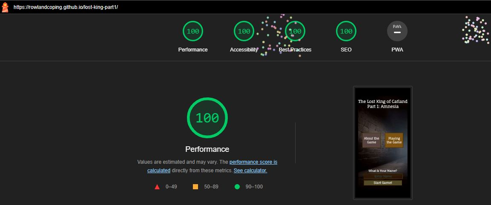

# Testing Documentation

([return to README](README.md))

## Contents

### Audit and Validation

[HTML Validation](#html-validation)\
[CSS Validation](#css-validation)\
[Lighthouse Audit](#lighthouse-audit)

### User Story Validation

[Restauranteur User Stories](#restauranteur-user-stories)\
[Customer User Stories](#customer-user-stories)

### Testing

[Automated Testing](#automated-testing)\
[Manual Testing](#manual-testing)\
[Bugs and Issues](#bugs-and-issues)

## Code Validation

### HTML Validation

([back to top](#testing-documentation))

I have completed a final validation of all HTML pages using the [W3C HTML validator](https://validator.w3.org/).

The issues that needed resolving were as follows:
 - There were a number of empty elements that were to be populated by Javascript which needed holding text
 - There were duplicate IDs on some buttons that were used in seperate game states, which needed changing to a class.
 - Images needed alt tags.  This was no small task, as it required adding alt tags to 40 game objects and updating the JavaScript accordingly in order to display the text.  There were also a number of default alt tags that needed adding in html.

### CSS Validation

([back to top](#testing-documentation))

I have completed a final validation of my 'style.css' file using the [W3C CSS validator](https://jigsaw.w3.org/css-validator/).\
There was one error caused by a likely copy and paste error, which was easily fixed.

### JavaScript Validation

I initially used JSLint but found it was overly strict.. Not only did I have hundreds of warnings concerned with alphabetical order, it also refused to recognise 'for' loops as legitimate JavaScript.
The reading I subsequently did suggests that the use of 'for' loops is a matter of preference, and it's certainly a method I have been taught on the course as standard practice!
Faced with the choice of either re-configuring JS Lint or refactoring more or less every line of my code I decided to look for an alternative.
After some research I decided that ESlint would be the most appropriate linter to use for this project.

On testing my JavaScipt file for errors, I found six using ES lint:
   - multiple errant semi-colons.
   - A duplicate function to close alerts on the homepage.
   - I had wrongly assigned my item filter function to a constant.  I'm not actually sure how it was working before amending it!

### Lighthouse Audit

#### Homepage

The initial lighthouse audit made only a couple of suggestions:
 - add a meta description for SEO purposes, which although not that relevant to this project feels like best practice!
 - convert any remaining jpegs to webp format to help load times.

#### Game State

I also conducted a test on the game state itself.  Some issues were identified which I have not addressed for reasons outlined below:
 - Table does not have headers:  The character stats section is in tablular form for very specific reasons - one is in order to properly align it with minimal code, and the other is because semantically it is tabular data.  The information in the table is self explanatory, and headers would not add semantic understanding and cause major layout issues besides, so I have not included them.
 - Headers out of sequence: I have jumped straight from h2 to h3 tags for a couple of reasons - one practical legacy reason is there used to be an h2 tag at the right side of the title bar until I reconfigured the page, therefore the issue did not exist.  The other is for other accessibility reasons, ie responsiveness.  If I set H2 tags it would require manually setting the font sizes which would be extremely problematic as the screen sizes changed.  It's a nice to have for the future when I have a lot more time, but at present I do not believe it causes any semantic difficulties.
 - Images sized by their containing elements: because I was setting image elements which did not previously exist as innerHTML it did not occur to me to style the image elements themselves prior to them existing.  It would require a lot of work now to rectify, refactoring a lot of the CSS. Whilst the site is not experiencing any notable performance issues and given my current time constraints I believe it is something that can be addressed in future iterations of the site.

## User Stories
([back to top](#testing-documentation))

## Testing
([back to top](#testing-documentation))

### Automated Testing
([back to top](#testing-documentation))

I initially intended to conduct automated testing with Jest throughout the project, and indeed did so throughout the initial iteration of the project.
A significant chunk of code has been tested automatically, including the item search and battle algorithm, as well as object states and even game states for the first two rooms.

With certain phases of the project, the value was quite clear - for example automated testing uncovered a number of issues with the item search algorithms.

However as the project has progressed the limitations of Jest and in particular my proficiency at using it has been exposed.  There are a number of reasons why I have removed automated testing from the project:
 - Personal knowledge: it became clear to me that in order to perform testing of some of the more complex functions, I needed knowledge of Jest way beyond what had been taught on the course, or that I had time to learn whislt working on this project (eg mock functions).  If I'm honest, and this comes from having consulted a LOT of sources, it seems Jest is no-where near as straightforward to use as its developers make out.
 - Time: towards the end of the first week I spent many hours attempting to properly configure Jest and use it for complete coverage.  It soon became clear with the amount of code that would need testing that this was impractical.
 - Effectiveness:  At the end of the first week working on the project, I found a major bug with the battle code, which hadn't been uncovered by Jest.  It was actually down to an error in my logic that persisted in my testing procedure delivering false positives - and therefore only manual testing was able to uncover the inconsistencies it created.  I quickly decided that my limited testing time would be better spent in that direction.
 - Project Scope: As a solo project mainly concerned with events in the DOM, the usefulness of automated testing was limited.  The sheer amount of code that needed testing and the simplicity of much of it turned testing into a purely academic exercise.
 - Jest coverage issues: because Jest insists of coverage of code that is not being tested, I have recently run into issues that I believe stem from asynchronicity.  Indeed, I have been unable to even load the test suites because Jest was getting hung up on the shuffle function, presumably because the page wasn't loading fully before Jest attempted to test it.  I have been unable to solve this in spite of investing a number of hours into it.

As a result of these issues, I have decided to remove all automated testing from the project directory including JavaScript files - there is no point the tests being there if they cannot be run!  I do have the files backed up so that I can potentially re-instate them in the future, and I have learned a great deal by taking it on, but for now in the context of this specific project I think it makes more sense to focus all my efforts on a comprehensive suite of manual tests.
It is a shame I think, especially on account of the time I have devoted to it.  I think it is potentially a useful tool, but one that I need to learn more about before I can get the best out of it.

### Bugs and Issues
([back to top](#testing-documentation))

Of course, this is by no means a comprehensive list, but gives an idea of some of the things I grappled with as I built this project.  It certainly has ended up being a great deal more complex than I originally anticipated.

#### Playtesting Issues

Due to the size of the project there have been many challenges and bugs that have appeared during testing both by myself and my playtesters.  Here are a few things that came up:
 - Locations leading to places they really shouldn't (one involved repeatedly acquiring a furry gilet)
 - Item images not having correct paths.  There was one issue with the insect repellent item involving extensive mis-spelling.  On correcting this it turned out the function itself was broken, so the insect repellent had no chance!
 - Typos.  A lot of typos.
 - There was one bug where the character would be anointed a god by the cat people(which would normally ive them the object they need to complete the game), but under certain circumstances would not be given the object.  I belive my girlfriend spend a considerable period of time trapped in the resultant endless gameplay loop with me telling her it was her fault!
 - There were a lot of bugs involving cat biscuits, one of which provided an endless supply.  It was a similar story for insect repellent, albeit a less useful one.

#### Coding Issues

 - A frustrating initial issue was a failure to load buttons on the page prior to the content I wanted on the buttons, which meant blank text.  I resolved it by changing the way I coded event listeners.
 - I had further issues removing event listeners to freeze the screen for custom alerts, which I could only resolve by refactoring the event listeners once again.
 - When it comes to html and css, I have discovered there are few issues that cannot be overcome by judicious use of flexbox.  It's been a revelation for me.

#### Item Search Mechanic Bugs

- I had serious problems with the initial iteration of the item search - because the nature of the for loop is that it returns the penultimate iteration of the loop, it meant certain items were not discoverable.
I also suspect I had either a less than or a greater than sign the wrong way round somewhere! I worked through multiple potential solution over the course of several hours before using the map function to create an array of potential values, which I was then able to iterate over using filter.
Although the code seemed to be functional, I have no idea how, because ESlint uncovered a huge issue with how it was implemented.

#### Battle mechanic bugs

The most entertaining bugs are reserved for combat: 
 - During automated testing I realised the player and enemy resistances function were just a series of if statements which meant variable values could be overwritten by subsequent logical outcomes; the function was over-compoicated and it didn't work. I revised it into two seperate functions for each turn cycle using if-else statements with a default else statement to ensure it could only return one value per round.
 - Initially numbers were not being passed as integers and undefined values were breaking the code.  I found the issue with trying to pass variables into a function from other functions and the variable therefore being out of scope.
 - There was initiall an issue with the enemy character ending with minus health - solved my manually setting value in DOM to zero. I also had to change the code to prevent the enemy from attacking after they were dead!
 - The biggest issue involved the defence resist mechanism.  Once an enemy's attack strength is decided the pplayer has a roll, modified by whatever armor they are wearing and thier defence stat, to see how many of those hits they can defend.
Having acquired a suit of plate armor, the best defensive item in the game, I noticed that Ragnar, the weakest opponent in the game, was hitting me for more damage than he had strength points, which is impossible.
In fact, the worse his statistics and the better mine were, the harder he hit me.  I died to him a couple of times before I found the problem.  If a character fails to resist any hits, they can often end up with a negative value.
What I had done was subtracted this negative value from the total hits, turning it into a positive and adding additional damage.  What compounded this problem is that I was applying enemy defensive values to my armor and vice versa.  The more pathetic Ragnar's armor (and by extension my armor), the more he added on to his rolls, producing crazy results. 
What's worse, the better the player armor the harder he was to kill, on account of him wearing it.  This bug was easily fixed by reversing the armor values and setting zero as the floor for an armor roll, but it made me laugh.
- I discovered a similar problem involving the revised resistances code - I used a single value for both characters so enemy resists or vulnerabilities were applied to the player.  In fact the most recent battle related bug was even worse - in an attempt to reduce the code I ended up multiplying the enemy's combat score by an unmodified decimal, meaning characters were bashing each other eternally to no effect.
- For some time, the potion section was not a passing value to the enemy round so the enemy was not getting a turn.  This was most obviously and amusingly manifested by endlessly clicking the use potion of catnip button and running up enormous negative scores. The bug was rectified by ensuring the necessary parameter was passed to the potion function.

#### User Driven Changes

A number of changes to the codebase were driven by user feedback:
 - Originally the golden orb was not carried as an object, but given the lack of usefulness of other objects after that point and the need for clarity I chose to simply have it replace any object the player was currently carrying.
 - The need was raised both by users and my mentor for clarity over what each item slot did.  This led to me refactoring the code with the current design solution.
 - It was also mentioned to me there was a lack of clarity in how weapons etc influenced stats, so I added this to the character sheet.  It required a lot of changes to the code but I think it really helps the UI, especially on mobile.

### Manual Testing
([back to top](#testing-documentation))

#### Game logic testing

Although I have used a degree of automated testing, the most useful and productive approach I have taken is by manually testing the code, using the console to replicate various game states, and console.log to understand what is going on.
For example, I found the quickest and most reliable way to easily undertand how the battle functions were working was to insert console logs at various stages to log outcomes.

In order to log comprehensive tests I have divided the code into seperate tables by game room, reflecting how the in-game code is divided into objects.  
I have also included seperate tables to test various key functions controlling the game mechanics - namely the item search, battle section, item alert boxes and helper functions. 

#### Responsiveness Testing

I have tested at (in descending order) 3080px, 1920px, 1080px, 768px, 320px.  This is reflective of the major break points.  
Please note that even beyond these key break points the game has been tested to look good with pretty much any screen size, including crucial variations on vertical height.

