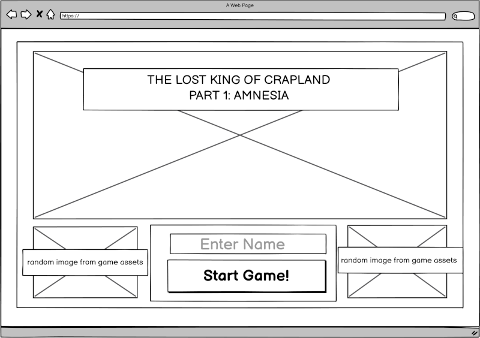
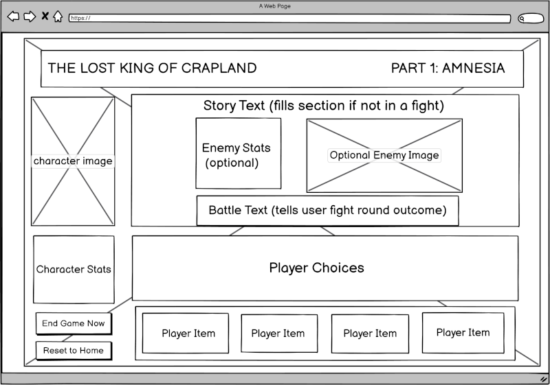
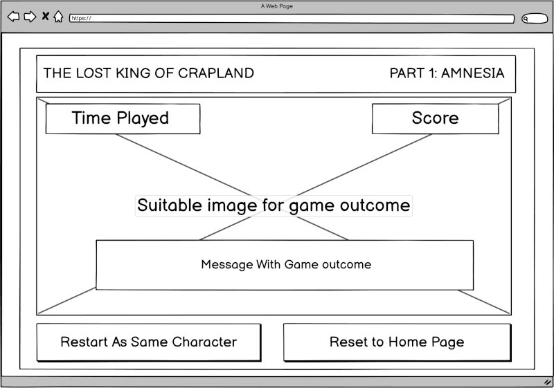
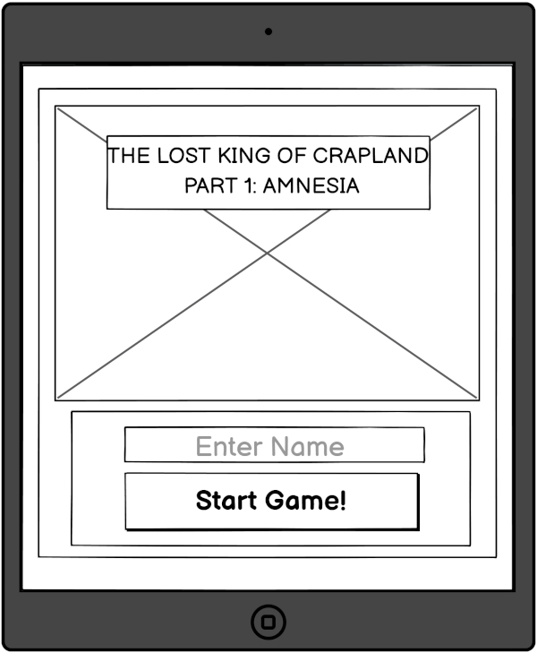
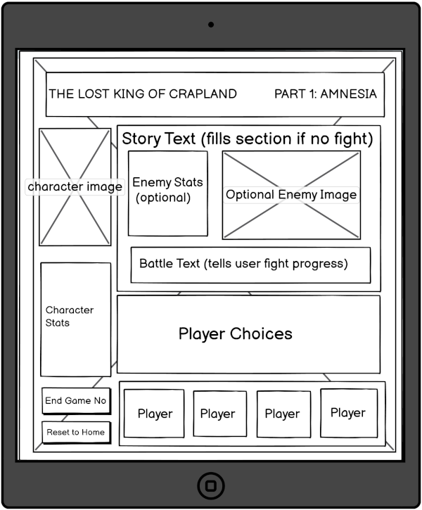
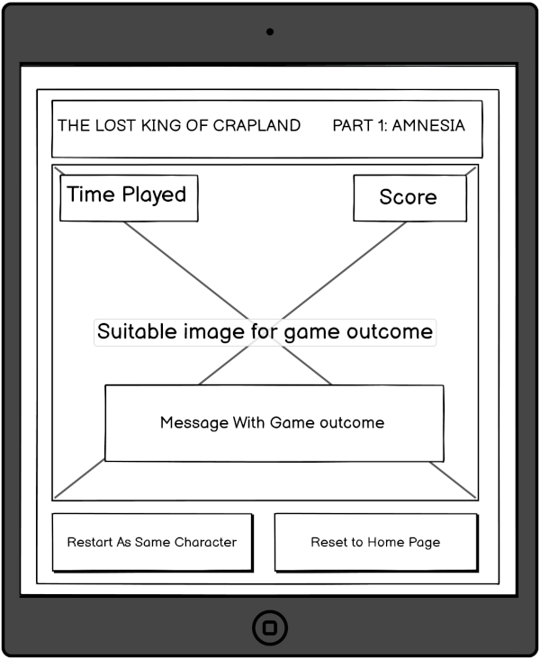
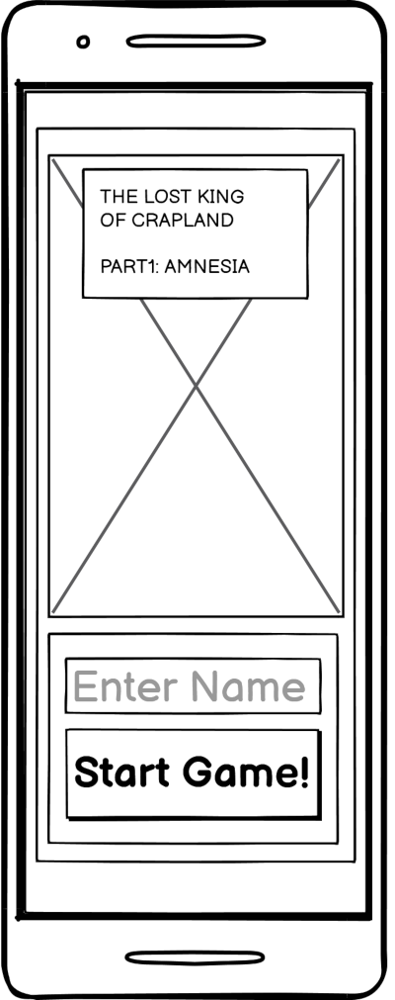
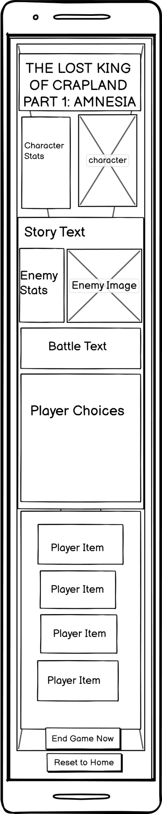
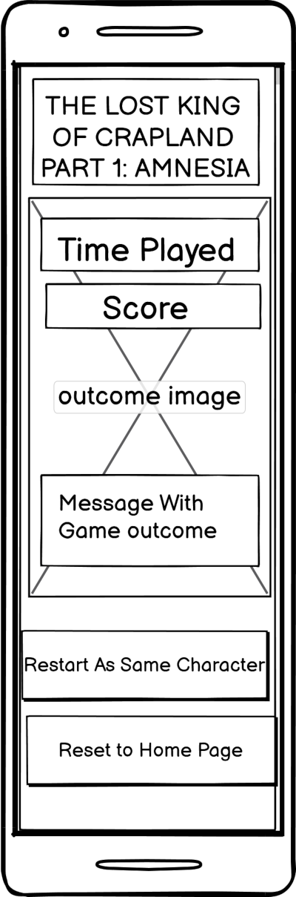

# Wireframes
([return to README](README.md))

## Primary Screen Size (1200px)

### Landing State

### Game State

 

### End State

 

## Tablet Screen Size (768px)

### Landing State

 
### Game State

### End State

 

## Mobile Screen Size (320px)

### Landing State

### Game State

### End State

([return to README](README.md))